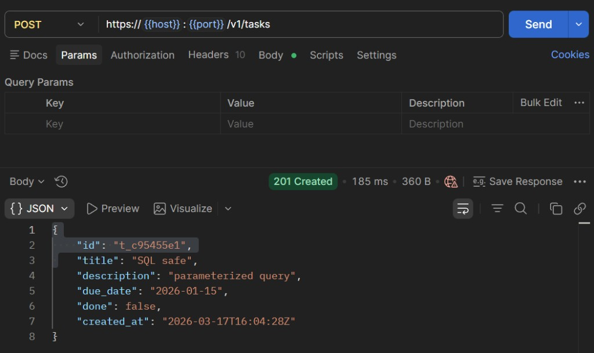
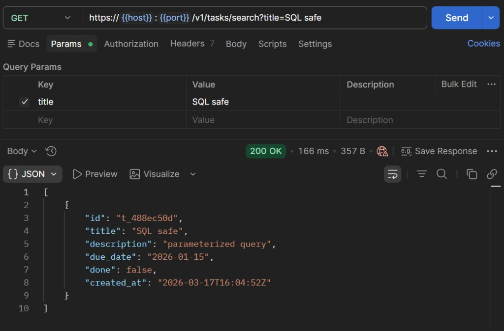
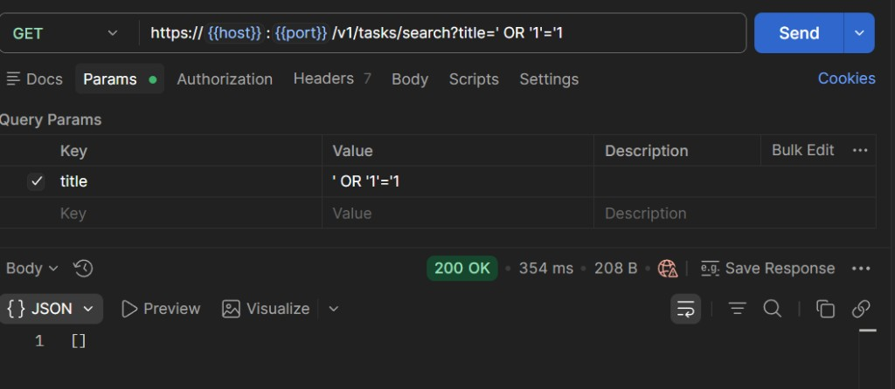

# Практическое задание 5
## Шишков А.Д. ЭФМО-02-25
## Тема
HTTPS/TLS и защита от SQL-инъекций в серверном приложении.

## Цель
Научиться включать защищённый транспорт (HTTPS) и устранять уязвимости SQL-инъекций, используя корректные методы работы с базой данных.

---

## 1. Выбор варианта TLS

Выбран **вариант 1: TLS на NGINX** (reverse proxy).

Почему:

- Разделение ответственности: приложение отвечает за бизнес-логику, NGINX — за шифрование.
- Проще управлять сертификатами: замена cert/key не требует пересборки приложения.
- NGINX оптимизирован для TLS: поддержка сессий, OCSP stapling, HTTP/2 — из коробки.

Схема:

```
Клиент --HTTPS:8443--> NGINX --HTTP:8082--> Tasks Service --SQL--> PostgreSQL
```

---

## 2. Генерация сертификата

```bash
cd deploy/tls
mkdir -p certs
openssl req -x509 -newkey rsa:2048 -nodes \
  -keyout certs/key.pem \
  -out certs/cert.pem \
  -days 365 \
  -subj "/CN=localhost"
```

Результат:
- `certs/key.pem` — приватный ключ 
- `certs/cert.pem` — самоподписанный сертификат 

---

## 3. Конфигурация NGINX

Файл `deploy/tls/nginx.conf`:

```nginx
events {}

http {
  server {
    listen 8443 ssl;
    server_name localhost;

    ssl_certificate     /etc/nginx/tls/cert.pem;
    ssl_certificate_key /etc/nginx/tls/key.pem;

    location / {
      proxy_pass http://tasks:8082;
      proxy_set_header Host $host;
      proxy_set_header X-Forwarded-Proto https;
      proxy_set_header X-Request-ID $http_x_request_id;
      proxy_set_header Authorization $http_authorization;
    }
  }
}
```

Ключевые моменты:
- NGINX слушает порт **8443** по HTTPS
- Проксирует на `tasks:8082` (HTTP внутри Docker-сети)
- Пробрасывает заголовки `Authorization` и `X-Request-ID` без изменений

---

## 4. Описание БД

Задачи хранятся в **PostgreSQL 15**. Таблица создаётся автоматически при старте сервиса:

```sql
CREATE TABLE IF NOT EXISTS tasks (
    id          TEXT PRIMARY KEY,
    title       TEXT NOT NULL,
    description TEXT DEFAULT '',
    due_date    TEXT DEFAULT '',
    done        BOOLEAN DEFAULT FALSE,
    created_at  TEXT NOT NULL
);
```

| Поле | Тип | Описание |
|------|-----|----------|
| `id` | TEXT | UUID задачи (`t_xxxxxxxx`) |
| `title` | TEXT | Название (NOT NULL) |
| `description` | TEXT | Описание |
| `due_date` | TEXT | Срок выполнения |
| `done` | BOOLEAN | Статус выполнения |
| `created_at` | TEXT | Дата создания (RFC 3339) |

Подключение через переменную окружения `DATABASE_URL`:

```
postgres://tasks:tasks@db:5432/tasks?sslmode=disable
```

---

## 5. Демонстрация защиты от SQL-инъекций

### Уязвимый запрос 

```go
query := "SELECT * FROM tasks WHERE title = '" + userInput + "'"
db.Query(query)
```

При вводе `' OR '1'='1` запрос превращается в:

```sql
SELECT * FROM tasks WHERE title = '' OR '1'='1'
```

Это возвращает **все** записи из таблицы — утечка данных.

### Безопасный запрос (параметризация)

```go
db.Query("SELECT * FROM tasks WHERE title = $1", userInput)
```

Параметр `$1` передаётся отдельно от SQL — драйвер экранирует значение. Инъекция невозможна: строка `' OR '1'='1` ищется как обычный title и ничего не находит.

### Проверка (с компьютера, IP сервера <SERVER_IP>)

Создать задачу, затем попытаться выполнить инъекцию:

```bash
# Создать задачу
curl.exe -k -X POST https://<SERVER_IP>:8443/v1/tasks -H "Content-Type: application/json" -H "Authorization: Bearer demo-token" -d "{\"title\":\"SQL safe\",\"description\":\"parameterized\",\"due_date\":\"2026-01-15\"}"

# Нормальный поиск — находит задачу
curl.exe -k "https://<SERVER_IP>:8443/v1/tasks/search?title=SQL%20safe" -H "Authorization: Bearer demo-token"

# Попытка SQL-инъекции — пустой результат (защита работает)
curl.exe -k "https://<SERVER_IP>:8443/v1/tasks/search?title=%27%20OR%20%271%27%3D%271" -H "Authorization: Bearer demo-token"
```

**1. Создание задачи через HTTPS (201 Created):**



**2. Нормальный поиск — находит задачу:**



**3. SQL-инъекция — пустой массив (защита работает):**



---

## 6. Инструкция запуска

Сервер — Ubuntu, тестирование — с компьютера. Замените `<SERVER_IP>` на IP вашего сервера.

### На сервере

```bash
# 1. Клонировать
git clone https://github.com/Alex171228/pz-5.2.git ~/pz5
cd ~/pz5
go mod download

# 2. Сгенерировать сертификат
cd deploy/tls
bash generate-cert.sh


# 3. Запустить Auth (на хосте)
cd ~/pz5
go run ./services/auth/cmd/auth 2>&1 &
sleep 2

# 4. Запустить Tasks + PostgreSQL + NGINX
cd ~/pz5/deploy/tls
docker compose up -d --build

# 5. Открыть порт HTTPS
sudo ufw allow 8443/tcp
```

### С компьютера (проверка)

Создать задачу:

```bash
curl.exe -k -X POST https://<SERVER_IP>:8443/v1/tasks -H "Content-Type: application/json" -H "Authorization: Bearer demo-token" -d "{\"title\":\"SQL safe\",\"description\":\"parameterized\",\"due_date\":\"2026-01-15\"}"
```

Получить все задачи через HTTPS:

```bash
curl.exe -k https://<SERVER_IP>:8443/v1/tasks -H "Authorization: Bearer demo-token"
```

Поиск по title (нормальный):

```bash
curl.exe -k "https://<SERVER_IP>:8443/v1/tasks/search?title=SQL%20safe" -H "Authorization: Bearer demo-token"
```

Попытка SQL-инъекции (должен вернуть пустой массив):

```bash
curl.exe -k "https://<SERVER_IP>:8443/v1/tasks/search?title=%27%20OR%20%271%27%3D%271" -H "Authorization: Bearer demo-token"
```

### Остановка (на сервере)

```bash
cd ~/pz5/deploy/tls
docker compose down
pkill -f "go run"
```

---

## 7. Контрольные вопросы

**1. Зачем нужен TLS-сертификат?**

TLS шифрует трафик между клиентом и сервером. Без TLS данные (включая токены и пароли) передаются открытым текстом и могут быть перехвачены (MITM-атака).

**2. Почему самоподписанный сертификат не подходит для продакшена?**

Браузеры и клиенты не доверяют самоподписанным сертификатам — нет проверки через цепочку CA. В продакшене используют сертификаты от Let's Encrypt или коммерческих CA.

**3. В чём преимущество TLS-терминации на NGINX перед TLS в приложении?**

NGINX оптимизирован для TLS (аппаратное ускорение, кэш сессий). Приложение не усложняется. Сертификат можно заменить без пересборки кода. Один NGINX может терминировать TLS для нескольких сервисов.

**4. Что такое SQL-инъекция?**

Атака, при которой злоумышленник внедряет SQL-код через пользовательский ввод. Если приложение подставляет ввод напрямую в SQL-запрос (конкатенация строк), атакующий может читать, изменять или удалять данные.

**5. Почему параметризованные запросы защищают от SQLi?**

Параметр (`$1`) передаётся драйверу отдельно от SQL-команды. Драйвер экранирует спецсимволы — значение всегда интерпретируется как данные, а не как часть SQL-синтаксиса.

**6. Почему нельзя просто фильтровать кавычки в пользовательском вводе?**

Фильтрация ненадёжна: существуют способы обхода (разные кодировки, Unicode, двойное экранирование). Параметризация — единственный надёжный способ, рекомендованный OWASP.
